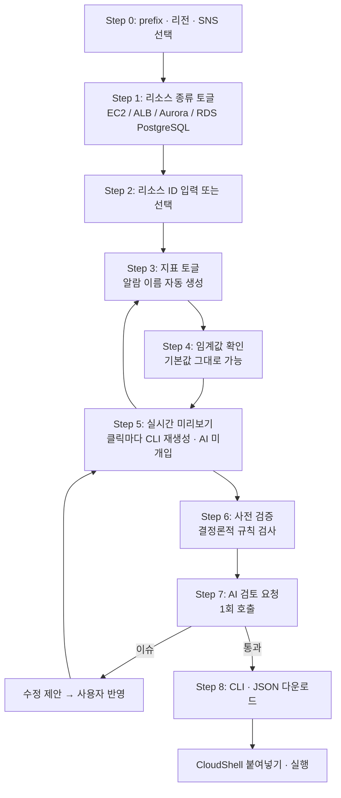

# CloudWatch Alarm Generator

> **⛔ 실행 전 반드시 읽기 — 아래 "절대 금지 목록"을 먼저 확인하세요.**
> AI·자동화·사람 모두 이 문서의 금지 목록을 준수해야 합니다.
> (AI 도구는 루트 `AGENTS.md`를 자동으로 읽고, 그 파일이 이 금지 목록을 정본으로 가리킵니다.)

## 실행 개요

- **한 줄 컨셉**: **실시간 모니터링 체계 구축으로 장애 인지 속도 개선.** 표준화된 CloudWatch
  알람을 빠짐없이·일관되게 깔아, 장애를 사람이 눈치채기 전에 알림으로 먼저 인지하게 만든다.
- **무엇인가**: 여러 리소스(EC2·ALB·RDS 등)에 대한 CloudWatch 알람을, 표준 템플릿으로 골라
  일괄 생성하는 CLI/스크립트를 만들어 주는 내부 도구.
- **왜 만들었나**: 팀원 여러 명이 여러 고객사에 알람을 설정할 때 임계값·네이밍이 제각각이 되는
  문제를 없애고, "우리 팀 표준"을 재사용·감사 가능한 형태로 고정하기 위해. 특히, 반복되는 수동작업을 ai를 활용해 자동화하기 위해. 
- **목적**: (1) 표준 정의 → (2) 고객사 리소스 조회·적용 → (3) 계정 실태와 표준 비교(감사) →
  (4) 누락·수정분만 생성. 대화식 CLI가 못 하는 **표준화·감사**가 이 도구의 차별점이며,
  이를 통해 **실시간 모니터링 체계**를 고객사 전반에 일관되게 세운다.
- **기대 효과**: 알람 커버리지 향상(누락 제거) → 장애 조기 인지 → 평균 감지 시간(MTTD) 단축 →
  대응·복구 시작 시점을 앞당겨 장애 영향 최소화.
- **동작 원칙**: 도구는 **읽기(조회)와 텍스트 생성만** 한다. 실제 알람 생성은 사람이
  검토 후 CloudShell에서 직접 실행한다. AI는 검토·제안만 하며 실행 권한이 없다.

## 주요 기능

- **표준 템플릿**: 자주 쓰는 알람 묶음(EC2·ALB·RDS)을 저장·재사용. RDS는 적용할 때
  엔진(Aurora PostgreSQL / RDS PostgreSQL / RDS MySQL·MariaDB)을 고른다. 팀 공유는 JSON 내보내기.
- **리소스 불러오기**: 대상 계정의 EC2·RDS·ALB를 라이브(로컬 백엔드)로 읽거나, CloudShell
  탐색 스크립트 출력을 붙여넣어 목록화 → 체크로 골라 알람 카드 자동 생성.
- **지표 토글 + 세부 설정**: 지표를 켜고 period·평가횟수(N/M)·통계·연산자·결측처리·심각도를 조정.
  CPU·메모리·디스크 같은 % 지표는 임계값이 알람 이름에 들어간다(`...-cpu-high-80` / `-90`).
- **산출물**: 실행용 CLI(`.sh`)와 재편집·버전관리용 JSON. 클립보드 복사·다운로드.
- **검증 3층**: 결정론적 사전 검증(문법·enum·산술) → 사전 점검(지표 실존, 읽기 전용) →
  AI 검토 프롬프트(임계값 타당성·누락·오탐 판단).
- **감사(표준 준수 검사)**: 계정의 기존 알람을 표준과 비교해 **일치 / 임계값 다름 / 누락 / 표준 외**로
  분류하고, **누락·수정분만** CLI로 생성. 매칭은 이름이 아니라 지표+디멘션 기준.
- **안전 가드**: 백엔드는 조회 API 화이트리스트만 실행, 산출 스크립트는 `put-metric-alarm` 외
  명령을 차단(코드로 강제).

## 사용 예시

**예시 1 — 새 고객사에 표준 알람 배포**
1. `npm run dev` + `npm run server` 실행 → 브라우저 `http://localhost:5173/`.
2. "웹 워크로드 알람" 표준 적용 → RDS 엔진 선택(예: RDS PostgreSQL).
3. "라이브 불러오기"로 대상 계정 리소스를 읽어 EC2·ALB·RDS 카드 자동 생성(ID 채워짐).
4. prefix·SNS ARN 입력, % 임계값 조정(예: CPU 80 → `...-cpu-high-80`).
5. 사전 검증 오류 0 확인 → CLI(.sh) 다운로드 → CloudShell에서 사람이 실행.

**예시 2 — 기존 고객사 점검(감사)**
1. 표준 적용 + 대상 리소스 ID 입력.
2. 감사 스크립트(읽기 전용) 실행 → 출력을 붙여넣고 "표준과 비교".
3. "누락 3건 / 임계값 다름 1건" 확인 → **누락·수정분만** CLI 생성 → 사람이 실행.
   (기존 다른 임계값 알람은 "표준 외"로 표시되며 자동 삭제하지 않음.)

## ⛔ 절대 금지 목록 (읽기 전용 원칙)

이 도구와 관련해 **어떤 경우에도 실행/생성하면 안 되는 작업**입니다. AI·자동화·사람 모두
아래를 위반하는 명령을 만들거나 실행해서는 안 됩니다.

**1) 고객 리소스 변경·삭제 금지**
- EC2/RDS/ALB 등 리소스의 중지·재부팅·삭제·수정 (`terminate-instances`, `stop-instances`,
  `reboot-instances`, `delete-db-instance`, `reboot-db-instance`, `modify-*`, `delete-load-balancer` 등)
- 태그·보안그룹·IAM·네트워크 등 리소스 설정 변경

**2) 기존 알람 삭제·비활성 금지**
- `delete-alarms`, `disable-alarm-actions`, 남이 만든 알람 덮어쓰기
- 감사 결과의 "표준 외" 알람을 임의로 삭제 (사람 확인 없이 절대 금지)

**3) 조회(읽기) 외 write API 금지**
- 허용되는 쓰기는 **`cloudwatch:PutMetricAlarm`(알람 생성/갱신)** 뿐이며, 이것도
  사람이 CloudShell에서 직접 실행할 때만.
- 그 외 모든 서비스의 생성/변경/삭제 API 금지.

**4) 승인되지 않은 계정 대상 금지**
- 허용된 계정(설정 파일/환경변수로 지정) 외 다른 계정 대상으로 조회·실행 금지.
- 조회용 IAM 역할은 **읽기 전용 용도로만**, 승인된 범위에서만 사용.

**5) 자격증명·데이터 노출 금지**
- 자격증명(액세스 키, 세션 토큰)을 브라우저·로그·산출물·프롬프트에 노출 금지.
- 고객 계정 ID·ARN을 외부로 전송하거나 커밋 금지.

**6) 파괴적·대량 작업 금지**
- 여러 리소스 일괄 삭제/변경, 스크립트에 삭제 명령 포함 금지.
- 롤백/정리 스크립트는 **주석 처리된 상태로만** 산출하고, 사람이 확인 후 수동 실행.

> 요약: **읽는다 + 알람을 만든다. 그 외에는 아무것도 건드리지 않는다.**
> 의심스러우면 실행하지 말고 사람에게 확인한다.

---

> (이하 설계 문서) 토글 버튼으로 리소스와 지표를 고르면 CloudWatch 알람 생성 CLI가 만들어지고,
> AI가 검토·수정한 뒤, 사람이 CloudShell에 붙여 실행하는 내부 웹 도구.

- 문서 버전: v0.3
- 기준: AWS CLI v2 (2.36.x)
- 작성일: 2026-08-20

---

## 1. 확정된 전제

| 항목 | 결정 |
|---|---|
| 대상 | **CloudWatch 알람만.** 다른 모니터링 도구는 이 도구의 범위 밖 |
| 사용자 | **팀 전체.** CloudFront + 백엔드로 사내 호스팅 |
| 입력 | 토글 버튼 클릭. 자유 입력은 prefix(또는 알람 이름 직접 지정)뿐 |
| 산출물 | **CLI 스크립트 + JSON 다운로드** |
| AI 역할 | 생성된 결과를 **검토·수정만**. 실행 권한 없음 |
| 실행 | 사람이 CloudShell에 붙여넣어 실행 |
| 초기 리소스 | EC2, ALB, RDS(Aurora / PostgreSQL) |

---

## 2. 사용자 플로우



Step 5까지는 AI가 개입하지 않습니다. 생성은 결정론적 코드가 하고, AI는 Step 7에서 한 번만 호출됩니다.

---

## 3. 화면 설계

### Step 0 — 전역 설정

| 필드 | 방식 | 예시 |
|---|---|---|
| prefix | 텍스트 입력 | `prd-was` |
| 리전 | 드롭다운 | `ap-northeast-2` |
| SNS Topic | 드롭다운 또는 붙여넣기 | `arn:aws:sns:...:ops-alert` |
| 심각도별 SNS 분리 | 토글 | critical / warning 각각 다른 토픽 |
| 네이밍 모드 | 라디오 | **자동 생성 + prefix 일괄** / **직접 입력** |

### Step 1~2 — 리소스 선택

- 리소스 종류를 토글로 켜면 해당 카탈로그가 열립니다.
- RDS는 **Aurora와 PostgreSQL을 반드시 분리**합니다. 사용 가능한 지표와 디멘션이 다릅니다(§5).
- 리소스 ID는 수동 입력 / CSV 붙여넣기 / 드롭다운(백엔드 조회) 세 가지. 드롭다운은 읽기 전용 자격증명이 필요합니다(§8).

### Step 3 — 지표 토글

지표별 배지로 사전 조건을 알립니다.

| 배지 | 의미 |
|---|---|
| `기본` | 대부분 켜야 하는 항목. 기본 체크됨 |
| `에이전트 필요` | CloudWatch Agent 설치 필요 (메모리·디스크) |
| `추가 과금` | 상세 모니터링·요청 메트릭 활성화 필요 |
| `인스턴스 의존` | 임계값이 인스턴스 클래스에 따라 달라짐 |

토글할 때마다 생성될 알람 이름이 그 자리에서 보여야 합니다. 이름이 곧 알람의 신원이기 때문입니다(§4).

### Step 4~5 — 임계값 · 미리보기

- 기본값만으로도 동작. 슬라이더로 override.
- 심각도(critical / warning / info)가 SNS 라우팅과 이름 접미사를 결정.
- 미리보기 탭: **CLI** / **JSON**. 우상단에 알람 개수, 경고 개수, 예상 월 비용.

---

## 4. 네이밍 규칙 — 가장 중요한 설계 결정

처음 구상하신 `{i-123345_ec2_cpu_utilization_80%}` 방식에는 되돌리기 어려운 문제가 셋 있습니다.

**임계값을 이름에 넣으면 안 됩니다.** `put-metric-alarm`은 **이름을 기준으로 upsert**합니다. 나중에 80%를 85%로 조정하면 이름이 바뀌므로 갱신이 아니라 **새 알람이 생기고, 80% 알람은 계정에 영구히 남습니다.** 아무 경고도 없이 조용히 두 개가 됩니다. 팀원 여러 명이 각자 임계값을 조정하는 환경에서는 몇 달 안에 유령 알람이 쌓입니다.

**`%` 문자는 피해야 합니다.** 알람 이름은 콘솔 딥링크와 ARN에 들어가고, `%`는 URL 인코딩 대상이라 링크가 깨집니다. 셸에서도 인용 처리가 필요해집니다.

**팀원 자유 네이밍은 관리 수단을 잃게 합니다.** 10명이 각자 이름을 지으면 prefix 기반 일괄 조회·정리가 불가능해집니다.

### 권장 규칙

```
{prefix}-{service}-{resourceShort}-{metricKey}-{severity}
```

| 대상 | 생성 이름 |
|---|---|
| EC2 CPU 경고 | `prd-was-ec2-i0abc123def4-cpu-high-warn` |
| Aurora 복제 지연 위험 | `prd-was-aurora-orders-cluster-replica-lag-crit` |
| RDS PostgreSQL 스토리지 부족 | `prd-was-pg-billing-db-storage-low-crit` |
| ALB 5xx 위험 | `prd-was-alb-front-elb5xx-crit` |

핵심 원칙: **이름에는 변하지 않는 것(무엇을 감시하는가)만 넣고, 변하는 것(얼마에서 울리는가)은 넣지 않습니다.**

- `resourceShort`: 리소스 ID에서 하이픈 제거 후 앞 12자
- 구분자는 하이픈으로 통일 (URL·셸에서 가장 안전)
- 심각도 약어 `crit` / `warn` / `info` — SNS 라우팅과 필터링에 사용
- 길이 제한 1~255자. prefix + 긴 클러스터 이름 조합 시 실시간 카운트 표시

### 임계값은 어디에 두는가

이름에서 뺀 정보는 두 곳에 넣습니다.

- **`--alarm-description`**: 사람이 읽을 조건 + **런북 링크**. 알림 본문에 그대로 노출되므로 새벽에 알람 받는 사람에게 첫 조치가 전달됩니다.
- **태그**: `Threshold`, `CatalogKey`, `Severity`, `ManagedBy=cw-alarm-generator`, `CreatedBy`(생성한 팀원)

**태그가 알람의 진짜 신원입니다.** 이름은 사람이 읽기 위한 것이고, 도구가 "내가 만든 알람"을 찾을 때는 `ManagedBy` 태그를 씁니다. 그래야 네이밍 규칙을 바꿔도 관리 능력을 잃지 않습니다.

### 직접 네이밍 모드

원하신 자유 입력은 남겨두되 가드레일을 답니다.

- 문자셋·길이 검증 통과 필수 (`%`, 공백, 비ASCII 거부)
- 같은 배치 내 중복 이름 거부
- 이름과 무관하게 `ManagedBy` 태그는 항상 주입
- 같은 이름의 알람이 계정에 이미 있으면 **"덮어쓰게 됩니다"** 경고 표시

마지막 항목이 팀 도구에서 특히 중요합니다. 두 사람이 같은 ALB에 다른 임계값으로 알람을 만들면 **나중에 실행한 쪽이 조용히 이깁니다.**

---

## 5. 알람 카탈로그

> 임계값은 출발점입니다. `Sum` 통계 항목은 period를 바꾸면 임계값도 함께 재검토해야 합니다.

### EC2 — `AWS/EC2` (dim: `InstanceId`)

| 지표 | 통계 | Period | N/M | 조건 | 기본값 | Missing | 배지 |
|---|---|---|---|---|---|---|---|
| `CPUUtilization` | Average | 300 | 3/2 | `>=` | 80 | missing | 기본 |
| `StatusCheckFailed_Instance` | Maximum | 60 | 2/2 | `>=` | 1 | breaching | 기본 |
| `StatusCheckFailed_System` | Maximum | 60 | 2/2 | `>=` | 1 | breaching | 기본 |
| `CPUCreditBalance` | Minimum | 300 | 3/3 | `<=` | 20 | missing | T 계열 전용 |
| `EBSIOBalance%` | Minimum | 300 | 3/3 | `<=` | 20 | notBreaching | Nitro + 버스트 볼륨 |
| `mem_used_percent` (CWAgent) | Average | 300 | 3/2 | `>=` | 85 | missing | 에이전트 필요 |
| `disk_used_percent` (CWAgent) | Average | 300 | 3/3 | `>=` | 85 | missing | 에이전트 필요 |

`disk_used_percent`는 디멘션에 `path` 또는 `device`가 추가로 필요합니다. UI에서 마운트 경로를 받아야 합니다.

### ALB — `AWS/ApplicationELB` (dim: `LoadBalancer`)

| 지표 | 통계 | Period | N/M | 조건 | 기본값 | Missing |
|---|---|---|---|---|---|---|
| `HTTPCode_ELB_5XX_Count` | Sum | 300 | 2/2 | `>` | 10 | notBreaching |
| `HTTPCode_Target_5XX_Count` | Sum | 300 | 2/2 | `>` | 20 | notBreaching |
| `TargetResponseTime` | p99 | 300 | 3/2 | `>` | 2초 | notBreaching |
| `UnHealthyHostCount` | Maximum | 60 | 3/2 | `>=` | 1 | breaching |
| `RejectedConnectionCount` | Sum | 300 | 2/2 | `>` | 0 | notBreaching |
| `TargetConnectionErrorCount` | Sum | 300 | 2/2 | `>` | 10 | notBreaching |

`UnHealthyHostCount`는 디멘션에 `TargetGroup`도 필요합니다. 카운트 지표는 트래픽이 없으면 데이터 포인트 자체가 없으므로 `notBreaching`이 필수입니다. `breaching`으로 두면 야간에 오탐이 쏟아집니다.

### Aurora PostgreSQL — `AWS/RDS`

클러스터 단위는 `DBClusterIdentifier`, 인스턴스 단위는 `DBInstanceIdentifier`를 씁니다. UI에서 어느 단위인지 구분해 받아야 합니다.

| 지표 | 통계 | Period | N/M | 조건 | 기본값 | 비고 |
|---|---|---|---|---|---|---|
| `CPUUtilization` | Average | 300 | 3/2 | `>=` | 80 | 기본 |
| `DatabaseConnections` | Maximum | 300 | 3/2 | `>=` | max_connections의 80% | 파라미터 그룹 의존 |
| `AuroraReplicaLag` | Maximum | 300 | 3/2 | `>` | 1000 | **밀리초** |
| `FreeLocalStorage` | Minimum | 300 | 3/3 | `<=` | 인스턴스별 산정 | **바이트**, 인스턴스 의존 |
| `DBLoad` | Average | 300 | 3/2 | `>` | vCPU 수 | Performance Insights 필요 |
| `Deadlocks` | Sum | 300 | 2/2 | `>` | 0 | notBreaching |
| `FreeableMemory` | Minimum | 300 | 3/3 | `<=` | 인스턴스 메모리의 10% | 인스턴스 의존 |

**Aurora에는 `FreeStorageSpace`가 없습니다.** 클러스터 볼륨이 자동 확장되기 때문입니다. 대신 임시 테이블·정렬에 쓰이는 로컬 스토리지를 보는 `FreeLocalStorage`를 씁니다. Aurora와 RDS를 한 카탈로그로 묶으면 여기서 반드시 사고가 납니다.

### RDS PostgreSQL (비 Aurora) — `AWS/RDS` (dim: `DBInstanceIdentifier`)

| 지표 | 통계 | Period | N/M | 조건 | 기본값 | 비고 |
|---|---|---|---|---|---|---|
| `CPUUtilization` | Average | 300 | 3/2 | `>=` | 80 | 기본 |
| `FreeStorageSpace` | Minimum | 300 | 2/2 | `<=` | 할당 용량의 15% | **바이트**, 기본 |
| `FreeableMemory` | Minimum | 300 | 3/3 | `<=` | 인스턴스 메모리의 10% | 인스턴스 의존 |
| `DatabaseConnections` | Maximum | 300 | 3/2 | `>=` | max_connections의 80% | |
| `ReadLatency` / `WriteLatency` | Average | 300 | 3/2 | `>` | 0.05 | **초** |
| `ReplicaLag` | Maximum | 300 | 3/2 | `>` | 30 | **초** (Aurora는 ms) |
| `DiskQueueDepth` | Average | 300 | 3/2 | `>` | 인스턴스별 | |
| `BurstBalance` | Minimum | 300 | 3/3 | `<=` | 20 | gp2 전용 |

### 단위·인스턴스 의존 지표 처리

카탈로그의 가장 큰 함정입니다. 팀원은 인스턴스 메모리 크기를 모릅니다.

| 문제 | 대응 |
|---|---|
| `FreeStorageSpace`, `FreeableMemory`, `FreeLocalStorage`가 **바이트** | UI에서 GiB로 받고 내부 변환. 미리보기에는 변환된 실제 값을 주석과 함께 노출 |
| 임계값이 인스턴스 클래스에 종속 | `인스턴스 의존` 배지 + 절대값 대신 **비율 입력**(예: 할당 용량의 15%)을 받아 계산 |
| 인스턴스 스펙을 모름 | 백엔드 읽기 조회로 클래스·할당 용량을 가져와 자동 계산. 조회가 없으면 이 지표는 기본 체크를 끄는 편이 안전 |
| `ReplicaLag`의 단위가 엔진별로 다름 | 카탈로그에 단위를 명시하고 UI 레이블에 노출 |

### 확장 후보 (Phase 2 이후)

NLB, ECS, Lambda, DynamoDB, SQS, ElastiCache, NAT Gateway, CloudFront, Step Functions.

CloudFront와 Billing 알람은 **`us-east-1` 강제**입니다. 생성기에서 리전을 하드코딩해야 합니다.

**복합 알람**도 후보입니다. 개별 알람의 액션을 끄고 복합 알람에만 SNS를 연결하면 노이즈가 크게 줄어듭니다. 계획된 작업 중 알림 억제는 복합 알람의 액션 서프레서 또는 알람 음소거 규칙(mute rule)으로 처리합니다. 도입 시점에 현재 지원 상태를 확인하세요.

---

## 6. 산출물

### CLI 스크립트

플래그 순서를 고정하고 `set -euo pipefail`을 헤더에 넣습니다. 순서 고정은 diff 노이즈를 없애기 위한 것입니다.

```bash
aws cloudwatch put-metric-alarm \
  --region "$REGION" \
  --alarm-name "prd-was-ec2-i0abc123def4-cpu-high-warn" \
  --alarm-description "CPU >= 80% (15분 중 10분). 런북: https://wiki/runbook/ec2-cpu" \
  --namespace "AWS/EC2" --metric-name "CPUUtilization" \
  --dimensions Name=InstanceId,Value=i-0abc123def456789 \
  --statistic Average --unit Percent \
  --period 300 --evaluation-periods 3 --datapoints-to-alarm 2 \
  --threshold 80 --comparison-operator GreaterThanOrEqualToThreshold \
  --treat-missing-data missing \
  --alarm-actions "$SNS_WARN" --ok-actions "$SNS_WARN" \
  --tags Key=ManagedBy,Value=cw-alarm-generator Key=Threshold,Value=80
```

이게 생성기가 뱉는 단위 블록입니다. 나머지는 이 형태의 반복입니다.

### JSON 다운로드

두 가지 용도를 겸합니다.

- **재편집**: 다시 업로드하면 UI 상태가 복원되어 임계값만 조정해 재생성 가능
- **Git 커밋**: 알람 설정 변경 이력을 PR로 리뷰

JSON은 화면 상태를 그대로 담은 단일 진실 공급원이고, CLI는 거기서 파생됩니다. 그래서 **AI 수정 제안은 CLI 텍스트를 직접 고치는 게 아니라 JSON을 고치고 CLI를 다시 생성**해야 합니다. 그러지 않으면 두 산출물이 어긋납니다.

### CLI가 표현하지 못하는 것

`put-metric-alarm`은 생성·갱신만 합니다. 토글을 껐다고 삭제 명령이 생기지 않습니다. `ManagedBy` 태그 기준으로 불필요한 알람을 찾는 정리 스크립트를 **주석 처리된 상태로 함께 내보내고**, 사람이 목록을 확인한 뒤 주석을 해제하게 합니다.

한 가지 더: **`--tags`는 신규 생성 시에만 적용되고 기존 알람 갱신 시에는 조용히 무시됩니다.** 에러도 나지 않습니다. 태그를 바꿔야 하면 `tag-resource` 명령을 별도로 출력해야 합니다. 그리고 생성 시 태그를 붙이려면 실행자에게 `cloudwatch:PutMetricAlarm`과 `cloudwatch:TagResource` 권한이 **둘 다** 있어야 합니다.

---

## 7. 검증 단계

### 역할 분담

AI에게 전부 맡기면 안 됩니다. 두 층으로 나눕니다.

| 검증 대상 | 담당 | 이유 |
|---|---|---|
| 플래그 존재, enum 값, 필수 파라미터 | 결정론적 검증기 | 환각 없이 100% 정확 |
| 산술 제약 (평가 횟수, period 배수) | 결정론적 검증기 | 규칙이 명확 |
| 지표·디멘션 실존 여부 | 읽기 전용 API 조회 | 사실 확인은 API가 정답 |
| 임계값이 이 워크로드에 합리적인가 | **AI** | 맥락 판단 필요 |
| 빠진 알람이 있는가 | **AI** | 도메인 지식 |
| 오탐 가능성·알람 피로 | **AI** | 정성 판단 |
| 최신 문법 여부 | **AI + 문서 grounding** | 근거를 함께 주입 |

### 사전 검증 체크리스트 (AI 호출 전)

- 알람 이름 중복 없음, 255자 이내, ASCII, `%`·공백 없음
- `datapointsToAlarm ≤ evaluationPeriods`
- `period`가 10/20/30 또는 60의 배수
- `period × evaluationPeriods ≤ 604800`초. `period < 3600`이면 `≤ 86400`초
- `period < 60`이면 경고 — 고해상도 알람으로 분류되어 **요금이 비싸지고**, 1분 해상도 지표에서는 `INSUFFICIENT_DATA`가 잦습니다
- `statistic`과 `extendedStatistic` 중 하나만
- `treatMissingData`가 `breaching` / `notBreaching` / `ignore` / `missing` 중 하나 (**대소문자 구분**)
- SNS 토픽 리전 == 알람 리전
- CloudFront·Billing 알람은 리전이 `us-east-1`
- 바이트 단위 지표의 임계값이 변환된 값인지
- `ManagedBy` 태그 포함
- 셸 이스케이프 안전성 (이름·설명에 `"`, `$`, 백틱 없음)

CloudWatch에는 `--dry-run`이 없습니다. 실질적인 대체는 `list-metrics`로 지표·디멘션 실존을 확인하는 것입니다. 지표가 없으면 알람은 만들어지지만 영구히 `INSUFFICIENT_DATA`에 머뭅니다.

### AI 검토 프롬프트 요건

프롬프트에 반드시 포함해야 하는 것:

1. **실제 유효 플래그 목록**을 근거로 주입 — AI가 "기억"이 아니라 "대조"를 하게 만듭니다. 이게 없으면 없는 플래그를 있다고 하거나 멀쩡한 걸 deprecated라고 합니다
2. **결정론적 사전 검증 결과** — 이미 잡힌 건 다시 지적하지 않도록
3. **워크로드 맥락** — 트래픽 패턴, 환경, 온콜 체계. 이게 없으면 임계값 판단이 불가능합니다
4. **금지 사항** — 근거 없는 최신성 단정 금지, 실행 시도 금지, 확신 없으면 confidence 낮추기

응답은 고정 스키마로 받습니다: `verdict`(pass / pass_with_warnings / fail), 항목별 `findings`(심각도·범주·문제·이유·수정안·확신도), `missingRecommendations`, 예상 비용.

`fail`이면 다운로드 버튼을 잠급니다. `pass_with_warnings`는 "경고 확인했음" 체크 후 통과시킵니다.

각 finding에 **"제안 적용"** 버튼을 두되, **JSON을 수정하고 CLI를 재생성**하는 경로를 거치게 합니다.

### 팀 도구에서 특히 주의할 점

주니어 팀원이 AI 제안을 그대로 적용할 가능성이 높습니다. 그래서 AI를 1차 방어선으로 두면 안 되고, 결정론적 검증기가 먼저 걸러야 합니다. AI finding에는 확신도를 항상 노출하고, `low` confidence 제안은 "제안 적용" 버튼을 비활성화하는 편이 안전합니다.

---

## 8. 시스템 아키텍처

### 구성

- **프론트엔드**: S3 + CloudFront (OAC). React + TypeScript
- **인증**: Cognito 또는 사내 SSO — **필수**
- **백엔드**: API Gateway + Lambda. 두 가지 역할만
  1. AI 검토 프록시 (Bedrock 호출)
  2. 리소스 목록 조회 (선택)

### 권한 경계 — 여기가 핵심

| 구성요소 | 권한 |
|---|---|
| 프론트엔드 | 없음 |
| AI 검토 Lambda | `bedrock:InvokeModel` **만** |
| 리소스 조회 Lambda | 읽기 전용 (`ec2:Describe*`, `rds:Describe*`, `elasticloadbalancing:Describe*`, `cloudwatch:ListMetrics`) |
| 실행자(사람, CloudShell) | `PutMetricAlarm`, `DescribeAlarms`, `ListMetrics`, `TagResource` |

**도구 어디에도 쓰기 권한을 주지 않습니다.** 이 경계가 무너지면 "AI가 알람을 잘못 만들었다"가 아니라 "AI가 프로덕션 알람을 지웠다"가 됩니다.

### 인증을 빼면 안 되는 이유

이 화면에는 계정 ID, 리소스 ID, SNS ARN, 네이밍 규칙이 노출됩니다. 인증 없이 URL만으로 접근 가능하면 정찰 정보를 그대로 공개하는 셈입니다. 사내망 전용이라도 Cognito 정도는 붙이는 게 맞습니다.

### 리소스 조회를 넣을지

| | 수동 입력 | 드롭다운 조회 |
|---|---|---|
| 자격증명 | 불필요 | 읽기 전용 역할 필요 |
| UX | 팀원이 ID를 찾아와야 함 | 훨씬 좋음 |
| 인스턴스 의존 임계값 | 자동 계산 불가 | 자동 계산 가능 |
| 보안 | 리스크 없음 | 팀 공유 자격증명 = 결정 사항 |

Phase 1은 수동 입력으로 시작해 백엔드 없이 배포하고, 팀 사용이 확인되면 조회를 붙이는 순서를 권합니다. 단 `FreeableMemory` 같은 인스턴스 의존 지표는 조회가 붙기 전까지 기본 체크를 끄는 게 안전합니다.

### AI 검토에 들어가는 식별자

프롬프트에 계정 ID와 ARN이 들어갑니다. 사내 정책상 문제가 되면 마스킹 토글을 제공하고 마스킹본으로 검토합니다.

---

## 9. CloudShell 실행 절차

다운로드 화면에 그대로 표시할 순서입니다.

| # | 동작 | 확인할 것 |
|---|---|---|
| 1 | CloudShell 열기 | 우상단 리전이 스크립트의 `--region`과 일치 |
| 2 | `aws sts get-caller-identity` | 의도한 계정·역할인지 |
| 3 | 스크립트 붙여넣기 | heredoc 사용 권장 (개행 깨짐 방지) |
| 4 | 육안 확인 | 리전, SNS ARN, 알람 개수 |
| 5 | `describe-alarms --alarm-name-prefix` | 같은 이름의 기존 알람이 있는지 (**있으면 덮어씀**) |
| 6 | **첫 알람 1건만 실행** | 권한 확인. 특히 `TagResource` 누락 여부 |
| 7 | 전체 실행 | |
| 8 | `describe-alarms`로 상태 확인 | 개수와 임계값 |
| 9 | `--state-value INSUFFICIENT_DATA` 조회 | 지표·디멘션 오타의 신호 |
| 10 | `set-alarm-state`로 1건 테스트 | SNS까지 실제로 도달하는지 |

6번을 건너뛰지 않는 게 중요합니다. 알람 50개를 만들다가 20번째에서 권한 오류로 멈추면 상태가 어중간해집니다.

10번은 알림 경로 검증입니다. 강제로 ALARM 상태를 넣어보고 실제로 알림이 오는지 확인합니다. 잠시 후 자동으로 실제 상태로 돌아갑니다.

알람 50개를 넘기면 API 스로틀링이 발생할 수 있습니다. 생성기가 루프에 짧은 대기를 넣어야 합니다. 재실행은 멱등이라 안전합니다.

---

## 10. 로드맵

**Phase 1 — 최소 동작**
카탈로그 4종(EC2, ALB, Aurora, RDS PostgreSQL). prefix + 토글 + 미리보기 + CLI·JSON 다운로드. 결정론적 사전 검증. AI 검토는 수동(생성 결과를 IDE 에이전트에 붙여 검토). 백엔드 없이 정적 배포 + 인증.

성공 기준: 팀원이 콘솔 대비 훨씬 빠르게 알람 30개를 만들고, 만들어진 알람 중 `INSUFFICIENT_DATA`가 0건.

**Phase 2 — 팀 실사용**
카탈로그 확장. Bedrock 기반 AI 검토 자동화. JSON 재업로드. 리소스 드롭다운 조회. 인스턴스 의존 임계값 자동 계산. 예상 비용 표시.

**Phase 3 — 자동화**
기존 알람 import 후 카탈로그와 차이 비교. 태그 기반 Metrics Insights 알람(알람 1개가 N개 리소스를 커버하고 새 리소스가 자동 포함). 복합 알람. Terraform 출력.

### 왜 카탈로그를 코드에 하드코딩하지 않는가

가치의 대부분은 UI가 아니라 **"ALB에 어떤 알람이 있어야 하고 임계값이 얼마인가"** 라는 판단에 있습니다. 이건 팀의 자산이므로 별도 설정 파일(YAML/JSON)로 분리하고 Git에서 PR로 리뷰하세요. React 컴포넌트 안에 숫자를 박으면 임계값 하나 바꿀 때마다 배포가 필요하고, 누가 왜 바꿨는지 남지 않습니다.

### Terraform은 언제 필요해지는가

지금 흐름(CLI → CloudShell)으로 충분합니다. 다만 두 상황에서 한계가 옵니다 — 알람 삭제·드리프트를 추적해야 할 때, 그리고 태그를 지속적으로 관리해야 할 때(`--tags`가 갱신 시 무시되는 문제). 그때 Phase 3의 Terraform 출력이 답이 됩니다. 지금 만들 필요는 없지만, **JSON을 단일 진실 공급원으로 두면** 나중에 Terraform 렌더러만 추가하면 됩니다. 이게 JSON 산출물이 중요한 두 번째 이유입니다.

---

## 11. 리스크

| 리스크 | 영향 | 대응 |
|---|---|---|
| **이름에 임계값 포함** | 임계값 변경 시 유령 알람 누적 | 이름에서 임계값 제거. 태그·설명으로 이동 (§4) |
| **팀원 간 알람 충돌** | 나중에 실행한 쪽이 조용히 덮어씀 | 이름 미리보기 + 기존 알람 존재 경고 |
| **자유 네이밍 남용** | 일괄 조회·정리 불가 | 검증 가드레일 + `ManagedBy` 태그 강제 |
| **`--tags`가 갱신 시 무시됨** | 태그 기반 관리가 깨짐 | `tag-resource` 병행 출력 |
| **AI가 없는 플래그를 있다고 함** | 잘못된 수정 → 실행 실패 | 플래그 목록 grounding + 결정론적 검증 우선 |
| **AI 제안 무비판 적용** | 특히 주니어 팀원 | 확신도 노출, low confidence는 적용 버튼 비활성 |
| **Aurora / RDS 지표 혼용** | 존재하지 않는 지표 → 영구 `INSUFFICIENT_DATA` | 카탈로그 분리 (§5) |
| **인스턴스 의존 임계값** | 무의미한 값 설정 | 비율 입력 + 배지 + 조회 없으면 기본 체크 해제 |
| **바이트 단위 착각** | 10GiB를 10으로 입력 | GiB 입력 후 내부 변환, 변환값 노출 |
| **`treatMissingData` 오설정** | 야간 오탐 폭발 | 카운트 지표는 `notBreaching` 강제 |
| **알람 피로** | 진짜 장애를 놓침 | 심각도별 SNS 분리. 장기적으로 복합 알람 |
| **런북 없는 알람** | 알림이 노이즈가 됨 | 카탈로그에 런북 링크를 1급 필드로 두고 설명에 주입 |
| **도구에 쓰기 권한 부여** | 사고 규모가 달라짐 | 백엔드는 Bedrock·읽기 전용만 (§8) |
| **인증 없는 배포** | 계정 정보 노출 | Cognito 또는 SSO 필수 |
| **리전당 알람 쿼타** | 생성 실패 | 실행 전 개수 확인. 쿼타는 Service Quotas에서 확인 |

---

## 12. 미결정 사항

1. **리소스 조회 자격증명** — 팀 공유 읽기 전용 역할을 둘지, 아니면 수동 입력을 유지할지. UX와 보안의 트레이드오프이고 Phase 2 범위를 결정합니다
2. **카탈로그 승인 프로세스** — 임계값을 누가 승인하는가. PR 리뷰어 지정
3. **심각도 라우팅** — critical을 실제로 페이징할지, 아니면 전부 Slack으로 보낼지. 온콜 체계 유무에 따라 다릅니다
4. **직접 네이밍 허용 범위** — 완전 자유로 둘지, prefix는 강제하고 뒷부분만 자유로 둘지. 팀 규모가 커질수록 후자가 안전합니다
5. **알람 삭제 책임** — 리소스가 없어졌을 때 알람을 지우는 주체. 지금 설계에는 이 경로가 없습니다

---

## 부록. 참고 문서

- [put-metric-alarm — AWS CLI Command Reference](https://docs.aws.amazon.com/cli/latest/reference/cloudwatch/put-metric-alarm.html)
- [PutMetricAlarm — CloudWatch API Reference](https://docs.aws.amazon.com/AmazonCloudWatch/latest/APIReference/API_PutMetricAlarm.html)
- [Create alarms — CloudWatch User Guide](https://docs.aws.amazon.com/AmazonCloudWatch/latest/monitoring/Create-Alarms.html)
- [Using Amazon CloudWatch alarms](https://docs.aws.amazon.com/AmazonCloudWatch/latest/monitoring/AlarmThatSendsEmail.html)
- [Amazon CloudWatch dimensions for Aurora](https://docs.aws.amazon.com/AmazonRDS/latest/AuroraUserGuide/metrics_dimensions.html)
- [Using CloudWatch metrics for Aurora PostgreSQL](https://docs.aws.amazon.com/AmazonRDS/latest/AuroraUserGuide/AuroraPostgreSQL_AnayzeResourceUsage.html)
- [Suppressing composite alarm actions](https://docs.aws.amazon.com/AmazonCloudWatch/latest/monitoring/Create_Composite_Alarm_Suppression.html)
- [Service level objectives (SLOs)](https://docs.aws.amazon.com/AmazonCloudWatch/latest/monitoring/CloudWatch-ServiceLevelObjectives.html)

> AWS 문서 내용은 라이선스 준수를 위해 요약·재구성했습니다.
